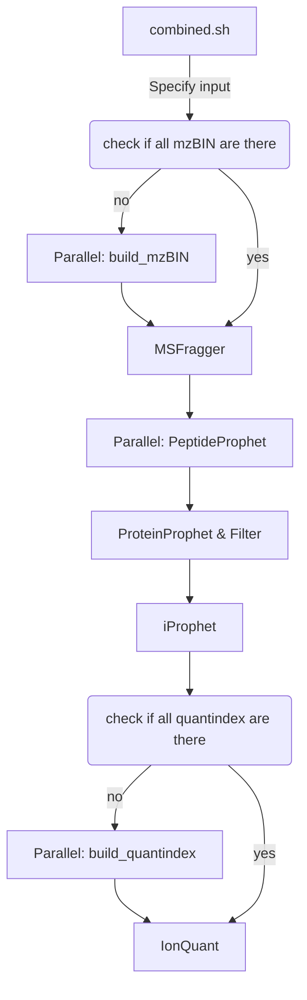

```mermaid
  graph TD;
    A[combined.sh] -->|Specify input| B(check if all mzBIN are there);
    B-->|no| C[Parallel: build_mzBIN] -->D[MSFragger];
    B-->|yes| D[MSFragger];
    D--> E[Parallel: PeptideProphet];
    E --> F[ProteinProphet & Filter];
    F --> G[iProphet];
    G[iProphet] --> H(check if all quantindex are there);
    H-->|no| I[Parallel: build_quantindex] -->J[IonQuant];
    H-->|yes| J[IonQuant];
```