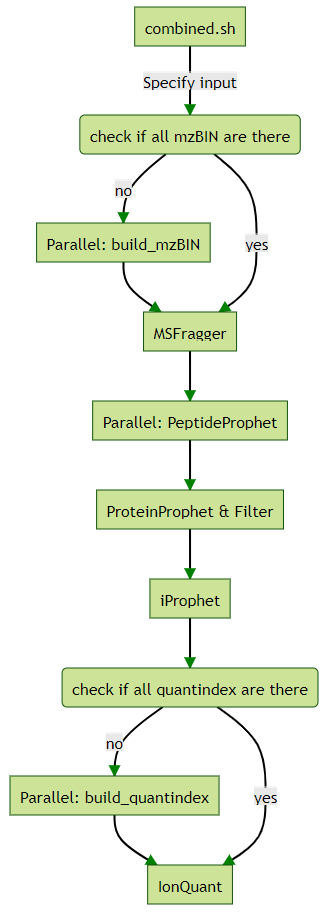

# Fragpipe Scripts on High Performance Computing

To facilitate speedy processing of large-scale proteomic studies we utilize High Performance Computing (HPC) and fragpipe. MSFragger 3.4, Philosopher 4.1.1 and IonQuant 1.7.17 were used and tested. On the HPC we have CentOS (7.9.2009) with OpenHPC (1.3), Slurm 18.08.8, singularity 3.6.4 and bash 4.2.46(2). A docker container was build with Ubuntu 20.04 with the dependencies as shown in the Dockerfile. The Docker container was transformed to a singularity container.

due to licensing of Fragpipe software we decided to keep all the required Fragpipe software out of the container. A schematic of the directory with all the data can be found in the treeMsfragger sub-directory. Do note that IonQuant has to be in the same subdirectory as MSFragger is. All software is called into the container by binding the directories.

# Schematic

Here I would put my text