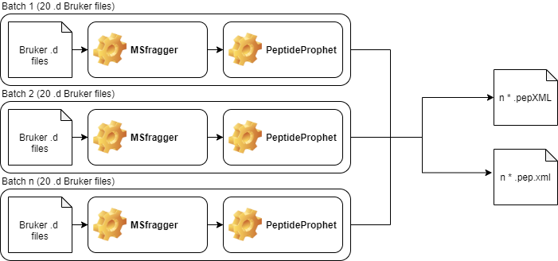

# Index
1. Introduction
2. Container @@@@@@@@@@@@@@@@ NUMBERING WRONG @@@@@@@@@@@@@@@@@@@@@
2. Prequisites
3. MSFragger + PeptideProphet
4. ProteinProphet + Philosopher
5. Write .quantindex
6. IonQuant

# Introduction

# Container

Running Fragpipe requires a containerized operating system, for which we use Ubuntu (20.04), including some depedencies such as Java. A Dockerfile is attached in this repository. We have also pushed a container to Dockerhub, which can easily be downloaded to a HPC with the following Singularity command:
'''
singularity build test docker://patrickvanzalm/ubuntu_fragpipe
'''

# MSfragger + PeptideProphet

For each input file (.d directory) the MSfragger and PeptideProphet processes will result in an .pepXML and .pep.xml file, respectively. The creation these files does not require any interaction between input samples, and thus could be parallelized. To do so, the user has to give the following information to the script:
1. Location of the .d Bruker Files
2. Location of the output directory
3. Number of files per batch (we suggest to use a minimum of 20*)

Based on the user input the XXXX.sh script will determine the number of .d files in the directory and start multiple batches based on the user input, with the last batch always including the modulo. For each batch it will run the Sbatch_MSfragger.sh script, which includes SLURM specifics, as well as loading and starting the singularity container. The container (Ubuntu XXX) will execute the following steps:
1. Make directories (msfragger, timstoffiles, outputfiles).
2. Copy msfragger from network to node.
3. Copy .d files to node **
4. Make sub-directories and set up the philosopher workspace for each .d file in the outputfiles directory
5. Run the MSfragger java process
6. Copy the .pepXML files from the timstoffiles directory to the outputfiles directory
7. Run the PeptideProphet java process
8. Check if equal number of .pep.xml and samples are found and if yes, copy outputfiles from Node to network storage.
9. Remove directories from the Node.
kk

*We noticed that if only a few bruker files are processed it might alter the fragment index width between batches. In our experience, batches of at least 20 will always lead to fragment indices of XX and XX, respectivly.

**We noticed that if we do not copy the .d files to the node speed was vastly reduced. During the loading of the .d file (i.e. writing the .mzBIN file) we observed a high number of read/write processes. Having the .d files locally on the Node compared to over the network vastly improved the speed.

# ProteinProphet + Philosopher

This script will run the following processes:
1. Set up database in outputfiles directory
2. Run proteinprophet for statistical validation of protein identifications
3. Set up databases in each of the samples
4. Filter each of the samples
5. Write reports for each of the samples
6. Run iProphet for multi-level integration analysis
7. Run Abacus to aggregate the data 

# Write .quantindex

We noticed that IonQuant writes .quantindex files for each .d bruker file. Doing so, it will use the Bruker extension, which currently only works single-threaded. due to the large amount of samples we wanted to process we had to parallelize this process. By testing we found that one can write the .quantindex files in advance, before starting the actual quantifcation step. Therefore, if we would run multiple instances of IonQuant that simultaniously write .quantindex files we can achieves higher speeds. Currently, IonQuant does not have a standalone function to write such .quantindex files. To overcome this issue, we implemented code that will keep track of the stdout from IonQuant. Once IonQuant pushes the "Updating Philosopher" to stdout we know that all .quantindex files are written and we kill the process. Since the writing of the .quantindex files is single threaded we do not need a large amount of computational power, making it possible to have multiple IonQuants running simultaniously to write .quantindex files.

In short, the script does the following:
1. Write the input parameter required for IonQuant. IonQuant requires a "--psm SAMPLE/psm.tsv" for each sample.
2. Run IonQuant, have the --writeindex parameter to true (1)
3. Once IonQuant pushes the "Updating Philosopher" string to stdout kill the process.

# IonQuant

With the .quantindex files available we can now fully quantify the data. As described above the script will first build all the --psm variables, followed by running the IonQuant. Notice that --writeindex is set to False (0) here. Once quantification finished it means searching the data has completed. To reduce data storage we also clean the workspaces. We do this for the output directory, as well as within each sample directory.

